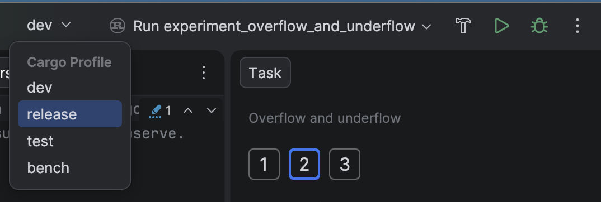
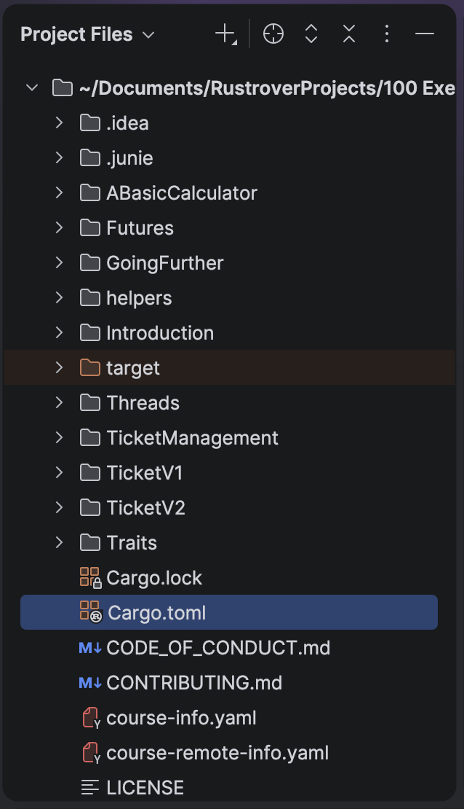

This is a hands-on **experiment** - there's nothing to submit. Just run the code and
watch what happens.

`main.rs` defines the same `factorial` function from earlier and calls
`factorial(20)`. As the theory explained, `20!` is far bigger than `u32::MAX`, so
this multiplication overflows.

## Run it under the `dev` profile

Run `main.rs` as it is (the green **▶** next to `main`). The `dev`
profile sets `overflow-checks = true` by default, so the program **panics** with
`attempt to multiply with overflow`.

## Make it wrap around

Now get the *same code* to **wrap around** instead of panicking by changing the
profile it's compiled with. The options to try are **release profile** and
**custom dev profile**.

### Release profile

To run under the release profile choose `release` from the drop-down menu at the top of
the IDE window, then press the green arrow to the right of it.



The `release` profile has `overflow-checks = false`, so `factorial(20)` wraps around and prints `2192834560`.

### Custom `dev` profile

Add the following to the `Cargo.toml` at the **root of the repository** and run again under `dev`.

```toml
[profile.dev]
overflow-checks = false
```

Profile settings are only read from the workspace root - not from a task's own `Cargo.toml`.
To locate the root `Cargo.toml` choose `Project Files` instead of `Course` in the course view.



Run the code under `dev` profile. It now wraps under `dev` too. Revert this change once you're done experimenting.

## Summary

Same code, different behaviour depending on the profile - that's `overflow-checks` at
work.
