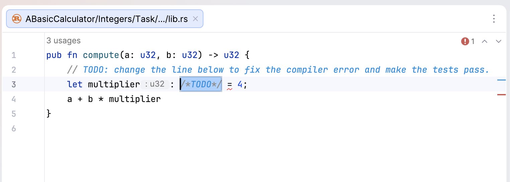
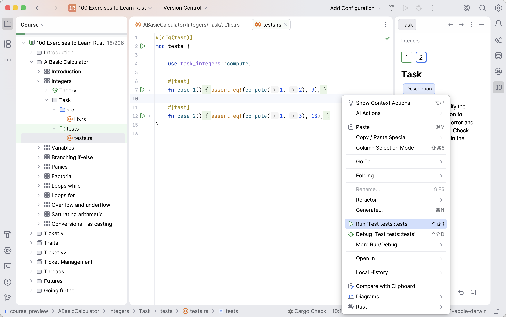

## Editor

The **Editor** is your playground where you will be programming. In theory tasks you can experiment here freely, without anything being checked.

For programming assignments, the Editor is where you'll fix the existing code or write your own code from scratch. This code will be checked.

If a task has no `main` function, you can still run its tests: open the `tests` directory, choose **Run** from the context menu, or press &shortcut:Run;:

Another way to check your code for a particular task is to click the **Check** button below the task description.

It can sometimes be helpful to run the `main` function, contained in the `main.rs` file, to see what output your code produces. Note that not every task has one.
If you want to go back to the Editor and focus on your code, the fastest way to do it is with the Hide All Windows command (&shortcut:HideAllWindows;). To get all the windows back, repeat the command.
