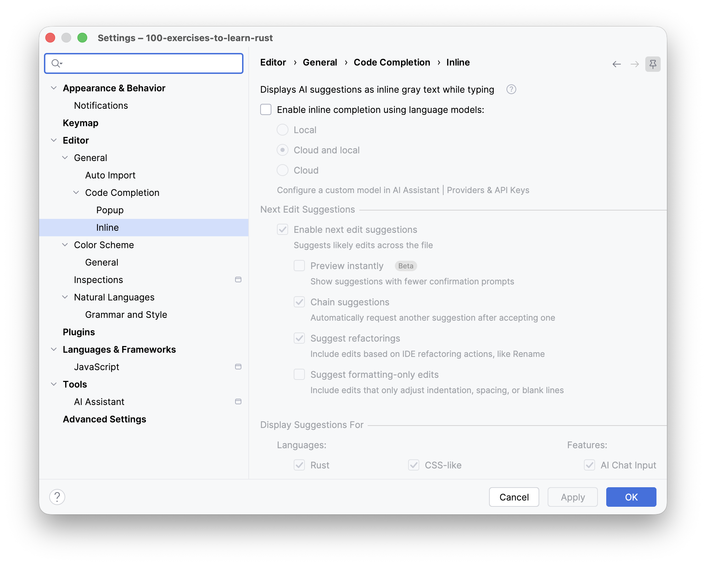
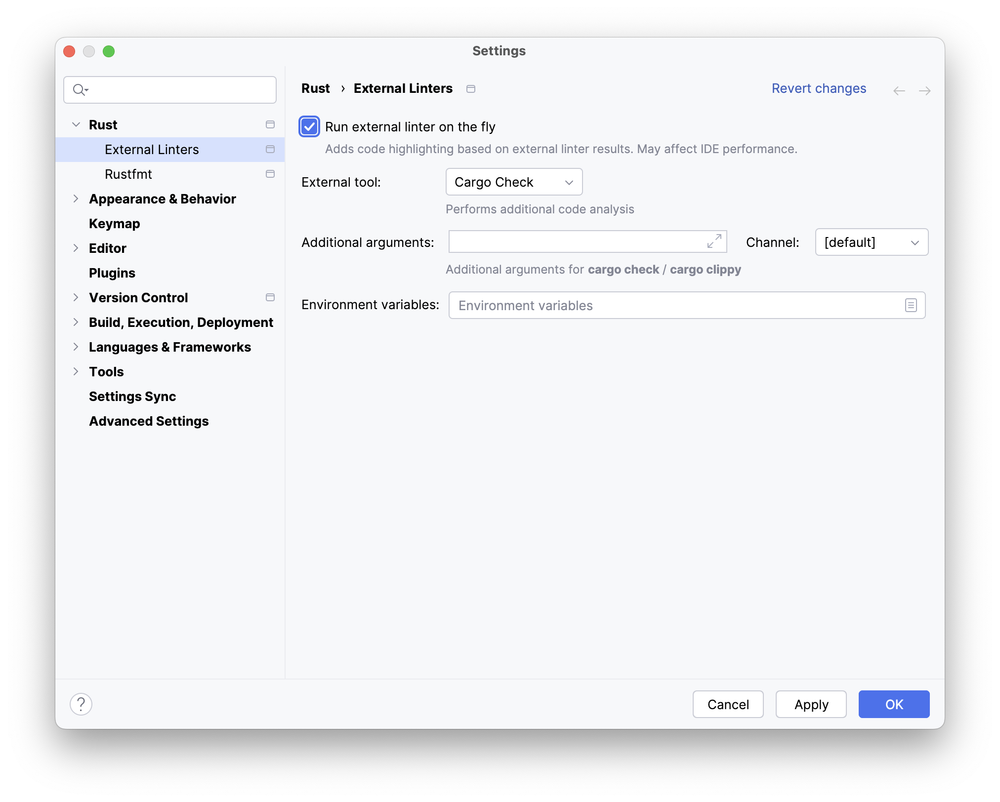

Three quick things before you start.
The first is a prerequisite for anything here to run; the other two are recommendations for this course.

### 1. Check that you have a Rust toolchain

Nothing in this course compiles without one, so it's worth thirty seconds now.

Open **Settings / Preferences | Rust** and look at the **Toolchain version** field.
If it shows a version, you're set. If it shows `N/A`, click **Install Rustup** and wait for it to finish: that installs
both the toolchain and the standard library.

If the automatic setup doesn't work, or you'd rather point the IDE at a toolchain you already have, see
**Do I need to install Rust?** in the next lesson.

### 2. Switch off AI code completion

We recommend turning AI-powered completion off for the duration of this course.

The exercises are small on purpose, and an AI suggestion will often produce the whole answer while you're still reading
the task. That's convenient, but it's also exactly the moment where the learning was supposed to happen.
You can always turn it back on when you work on your own projects.

1. Go to **Settings / Preferences | Editor | General | Code Completion | Inline**.
2. Clear the **Enable inline completion using language models** checkbox.
3. Press **OK**.

> 💡 **Note**
>
> This does not turn off ordinary code completion, the popup that lists methods and types based on what's actually in
> scope. Keep that one! It's driven by the compiler's knowledge of your code, and browsing what a type offers is a good
> way to get familiar with the standard library.

Asking an AI assistant to _explain_ something is still very much encouraged.
See **Can I use AI?** in the next lesson.

### 3. Check that the external linter is on

This one you want _enabled_. It runs `cargo check` as you type, so you see real compiler errors right in the editor
instead of discovering them when you run the tests.
This course leans a lot on reading compiler messages, so it's worth confirming that the linter is active.
It usually is by default.

1. Go to **Settings / Preferences | Rust | External Linters**.
2. Set the parameters as follows:
   - Check the **Run external linter on the fly** box.
   - In the **External Tool** list, select **Cargo Check**.
3. Press **OK**.

